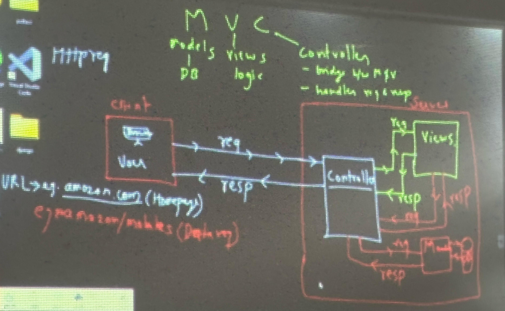

# Day02: 18-Jan-2025

- 3 Tier Architecture
- mvc architecture and its working

### MVC

1. Why do we need a architecture/design pattern like MVC for our websites?

    - These days websites are not just simple html and css.
    - They have shifted to incredibly complex applications with thousands of developers working on them at the same time
    - So, **to make the code less complex and easier to work** on them, we use different design pattern.

2. What is MVC?
- Most used in industry
- It is a design pattern which breaks an application into 3 parts:
    - `Model`: data related (dB)
    - `View`: logic and presentation related
    - `Controller`: 
        - bridge between Model and View
        - handles the flow of request and response

- Django **`does not use`** MVC 

### related images

- 3 Tier architecture  

- MVC architecture and its working  

