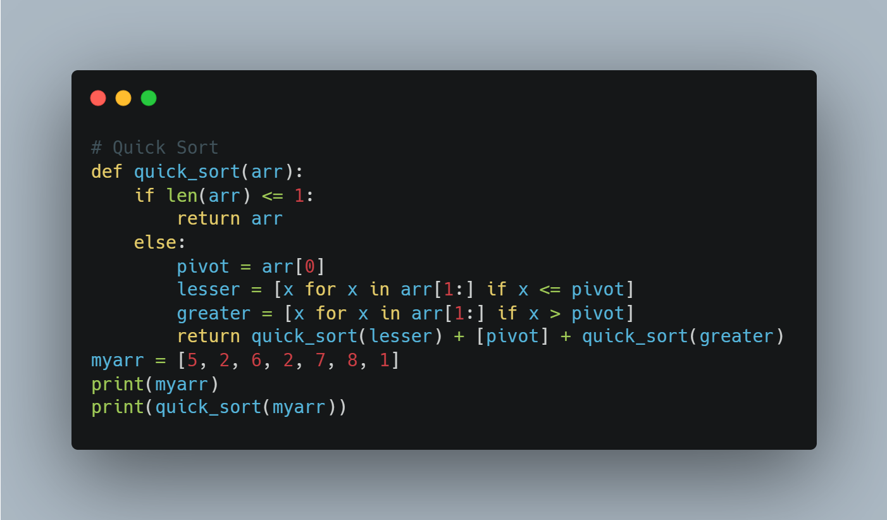

# PythonProgramming

programming questions and materials from PySpider

## [Notes](notes.md)

## list of methods in each collection datatype
- > create your own list using excel

## Searching Algorithms

   
  

## Sorting Algorithms

   
  

   
  

   
   

## Data Analysis library

1. PANDAS
2. NUMPY
3. MATPLOTLIB
4. SEABORN
5. PowerBI